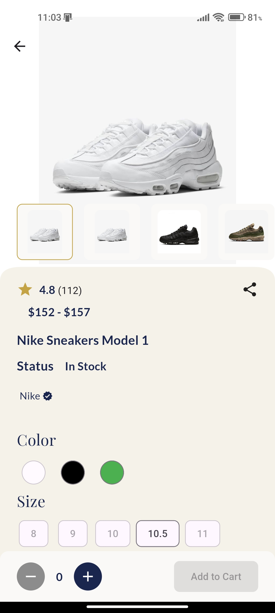
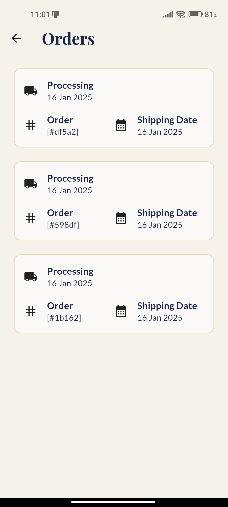

# Stride & Style

<div align="center">

*A Showcase Flutter E-Commerce App for Men's Footwear*

[Features](#features) · [Installation](#installation) · [Documentation](#documentation) · [Contact](#contact)

</div>

## Overview

Stride & Style is a modern, cross-platform e-commerce application designed to demonstrate the capabilities of Flutter in building functional and aesthetically pleasing e-commerce apps. Created as an educational project, this app showcases features like authentication, cart and favorites management, product sorting, checkout, and user profile setup while catering to a wide variety of men's footwear options, including sneakers, boots, classic shoes, and regular shoes.

You can explore the key features of this app by downloading it from this [Drive Link](https://drive.google.com/file/d/1SMOcpmq1UX9w4JpVZjM6x2qbxiFz08LA/view?usp=drive_link), or you can check the screenshots below:

<details>
<summary><strong>Authentication</strong></summary>

<div align="center">
  
  
  
</div>

</details>

<details>
<summary><strong>Home</strong></summary>

<div align="center">
  
  
</div>

</details>

<details>
<summary><strong>Store</strong></summary>

<div align="center">
  
  
  
</div>

</details>


<details>
<summary><strong>Favorites</strong></summary>

<div align="center">
  
</div>

</details>

<details>
<summary><strong>Products</strong></summary>

<div align="center">
  
  
  
  
  
  
</div>

</details>

<details>
<summary><strong>Cart Management</strong></summary>

<div align="center">
  
  
  
  
  
</div>

</details>


<details>
<summary><strong>Profile</strong></summary>

<div align="center">
  
  
</div>

</details>

## Features

### Core Capabilities

- **Authentication**
  - Secure email/password login
  - Google Sign-In integration
  - Email verification and password reset

- **Product Management**
  - Sorting by name, price, selling trends, brand, and category
  - Variations for products (colors and sizes)

- **Cart and Favorites Management**
  - Add and remove items from the cart
  - Save favorite items for later

- **User Profile and Preferences**
  - Profile setup and management (name, phone number, email, username, gender..etc)
  - Address and payment method addition

- **Order Tracking**
  - Monitor order history and current status

### Future Enhancements

- **Payment Gateway Integration**
  - Stripe integration for secure payments

## Technical Stack

- **Frontend:** Flutter
- **Backend:** Firebase Authentication, Firestore Database
- **File Storage:** Supabase
- **State Management:** GetX
- **Key Packages:**
  - firebase_auth
  - cloud_firestore
  - supabase_flutter
  - get

## ❗IMPORTANT❗
This project was inspired by a YouTube playlist. While the general structure and functionality were influenced by the playlist, the app reflects my personal learning and development journey with Flutter framework.

## Installation

```bash
# Clone the repository
git clone https://github.com/jaliil-9/Flutter-E-commerce-App--Stride-and-Style-.git

# Navigate to project directory
cd Flutter-E-commerce-App--Stride-and-Style-

# Install dependencies
flutter pub get

# Run the app
flutter run
```

### System Requirements

- Flutter (latest stable version)
- Android Studio / VS Code
- Android SDK version with:
  - NDK version 25.1.8937393
  - Java version 17
  - Gradle 8.10.2

## Documentation

For detailed documentation, please see:
- [User Guide](docs/USER_GUIDE.md)
- [Technical Documentation](docs/TECHNICAL.md)

## About the Developer

I am Abdeldjalil Bouziane, a Biotechnology Engineer specializing in Health Biotechnology, with expertise in:
- Cross-platform Mobile Development (Flutter)
- Machine Learning and Deep Learning
- Laboratory Processes and Workflows

## Contact

- Email: jalilbouziane@protonmail.com
- LinkedIn: [Abdeldjalil Bouziane](https://www.linkedin.com/in/abdeldjalil-bouziane-0a7079288/)

## License

This project is licensed under the MIT License - see the [LICENSE](LICENSE) file for details.


